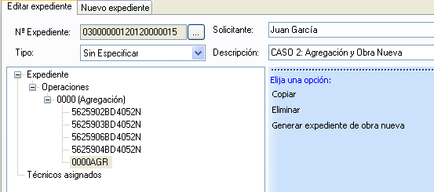
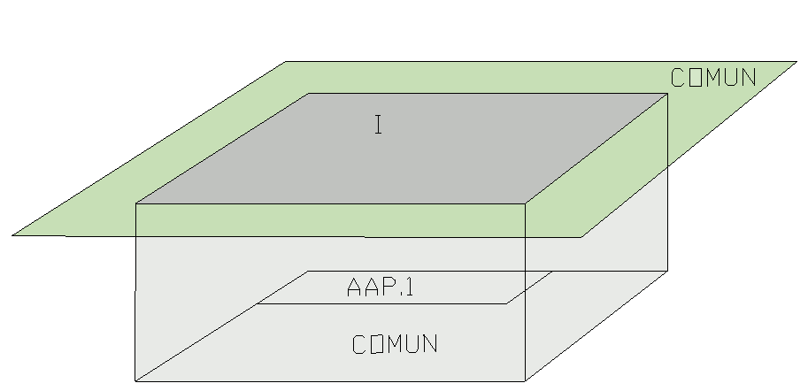
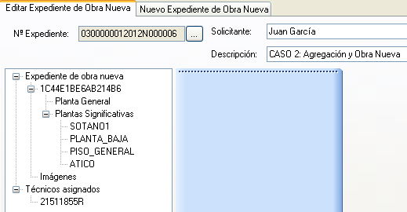

# Agregación, Obra Nueva y División Horizontal

*SUPUESTO DE HECHO:*

Juan García adquiere cuatro parcelas para empezar a contruir en ellos un bloque de cinco plantas con un total de veintiseis viviendas y dos plantas en subsuelo para plazas de garaje y trasteros, para su posterior promoción y venta.
Las referencias catastrales involucradas son:

**5625902BD4052N**

**5625903BD4052N**

**5625906BD4052N**

**5625904BD4052N** 

**1. Agregación**

*Procedimiento a seguir:*

El Notario crea una nueva operación correspondiente a la agrupación y descarga, uno a uno, los inmuebles correspondientes a dichas referencias catastrales, archivando el expediente una vez terminada la descarga.
1. Nos aseguramos que estamos en la pestaña de **nuevo expediente**.
2. El programa asigna un numero de expediente automáticamente.
3. Le indicamos el tipo de operación que se va a realizar.
4. Le indicamos el solicitante.
5. Insertamos una breve descripción del proyecto.
6. Con el botón derecho sobre **Operaciones** le indicamos la operación que vamos a realizar.
7. Se añaden, una a una, todas las fincas implicadas.
8. Ventana donde se cargan las referencias catastrales de las fincas implicadas en la operación de agregación.
9. Podemos visualizar las cuatro parcelas que hemos añadido en la ventana gráfica.
10. Una vez descargados todos los inmuebles, el Notario genera el fichero respondiente al inmueble resultante de la agrupación, mediante Generación de parcela resultante.
11. A continuación se procede a la operación de **Obra Nueva**. Sobre la parcela resultante, seleccionamos la opción **Generar expediente de obra nueva**. 
12. Se abre un nuevo expediente de Obra Nueva cuya referencia catastral asignada a la parcela nueva es un código temporal asignado por la aplicación.

2. Obra Nueva

*Procedimiento a seguir*

1. Como ya se ha expuesto en el caso anterior (ver declaración de Obra Nueva), la planta general es la representación, dentro de la línea perimetral de la parcela, de los recintos de las distintas subparcelas o áreas de diferente grado o tipo de edificación que la componen.  Coincide con representación de la parcela en la cartografía catastral. Es lo que el RD/1997 define como superficie de ocupación en planta. 
	A continuación sobre la planta general el técnico va a definir cada una de las plantas, en este caso cinco, que componen la edificación distinguiendo en cada una de ellas, cada una de las unidades susceptibles de aprovechamiento independiente, y a su vez, dentro de cada una de éstas, las zonas dedicadas a sus diferentes usos (vivienda, terraza, etc...). Así mismo, dentro de cada planta, la zona que no quede asignada a formar parte de una unidad independiente, se considera siempre, zona o elementos comunes. De acuerdo con la terminología catastral, todas las plantas iguales en superficie y uso dentro de una construcción reciben la denominación de planta significativa. Pero en todo caso, la aplicación distingue el nivel en que se halla cada planta. 
         Así por ejemplo, en la siguietne figura se puede apreciar el aspecto y distribución que tendría una planta significativa de una obra nueva con creación dentro de cada planta de unidades independientes (a su vez con sus usos respectivos). Cada **planta significativa** tendrá incluidas todas las construcciones de esa planta en todos los edificios. Por ejemplo, si una parcela tiene dos edificios, uno de dos plantas y otro de una, en la planta baja estarán los dos edificios y en la primera solo el que tiene dos plantas.   