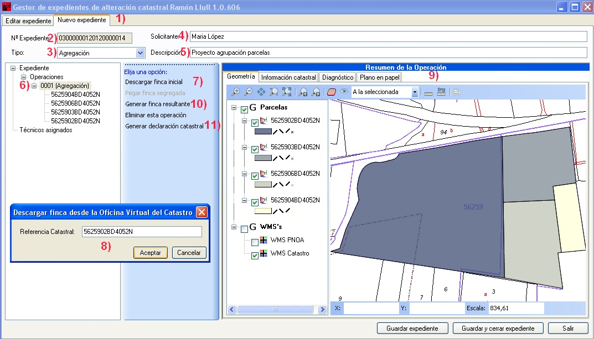

# Agregación, Obra Nueva y División Horizontal

*SUPUESTO DE HECHO:*

Juan García adquiere cuatro parcelas para empezar a contruir en ellos un bloque de cinco plantas con un total de veintiseis viviendas y dos plantas en subsuelo para plazas de garaje y trasteros, para su posterior promoción y venta.
Las referencias catastrales involucradas son:

**5625902BD4052N**

**5625903BD4052N**

**5625906BD4052N**

**5625904BD4052N** 

**1. Agregación**

*Procedimiento a seguir:*

El Notario crea una nueva operación correspondiente a la agrupación y descarga, uno a uno, los inmuebles correspondientes a dichas referencias catastrales, archivando el expediente una vez terminada la descarga.
1. Nos aseguramos que estamos en la pestaña de **nuevo expediente**.
2. El programa asigna un numero de expediente automáticamente.
3. Le indicamos el tipo de operación que se va a realizar.
4. Le indicamos el solicitante.
5. Insertamos una breve descripción del proyecto.
6. Con el botón derecho sobre **Operaciones** le indicamos la operación que vamos a realizar.
7. Se añaden, una a una, todas las fincas implicadas.
8. Ventana donde se cargan las referencias catastrales de las fincas implicadas en la operación de agregación.
9. Podemos visualizar las cuatro parcelas que hemos añadido en la ventana gráfica.
10. Una vez descargados todos los inmuebles, el Notario genera el fichero respondiente al inmueble resultante de la agrupación, mediante Generación de parcela resultante.
11. A continuación se procede a la operación de **Obra Nueva**. Sobre la parcela resultante, seleccionamos la opción **Generar expediente de obra nueva**.