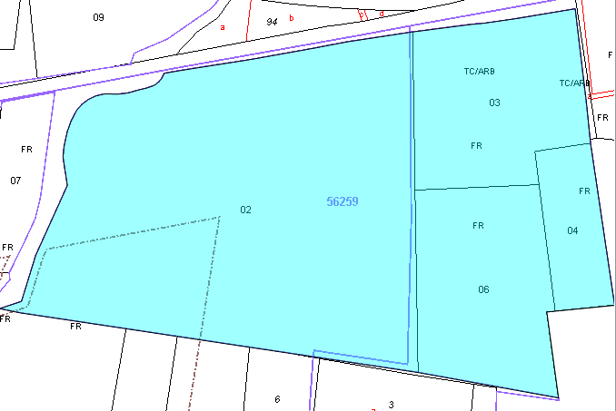
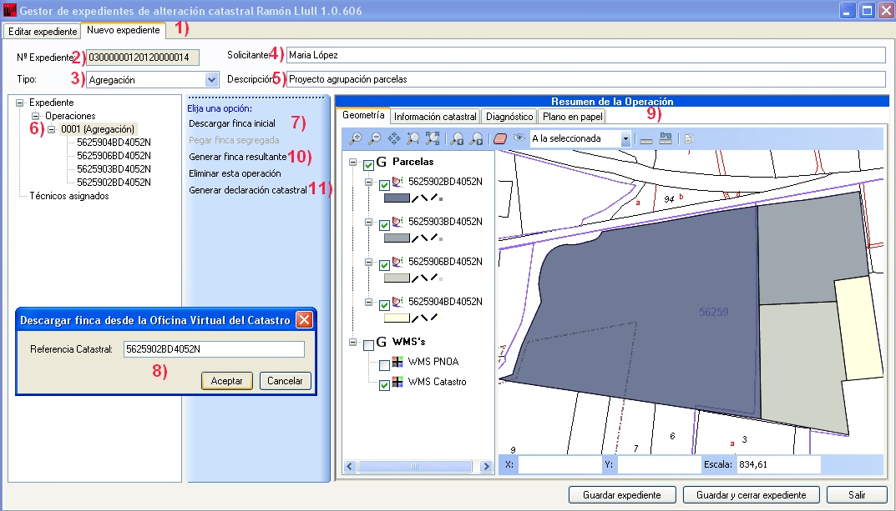
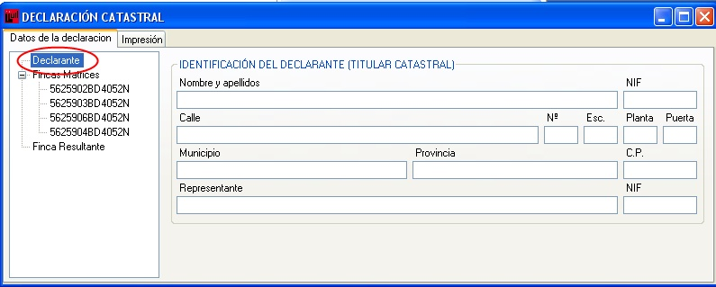

# Agregación + División

*Supuesto de hecho:*

María López compra cuatro parcelas colindantes para proyectar futuras viviendas. Por ello acude a la notaría con objeto de agrupar dichas parcelas en una finca. La parcela resultante de la agrupación se quiere dividir en ocho parcelas, seis para una promoción, otra para su cesión al Ayuntamiento, que condiciona concesión de la licencia a la cesión de la parcela citada.

*Referencias catastrales: *

**5625902BD4052N**

**5625903BD4052N**

**5625906BD4052N**

**5625904BD4052N**

1. Agrupación

*Resumen de la operación:*

La **Notaría** genera una nueva operación correspondiente a la agrupación y descarga, uno a uno, los inmuebles correspondientes a dichas referencias catastrales, archivando el expediente una vez terminada la descarga y asigna el expediente al técnico que va a realizar la división posterior.

*Procedimiento a seguir: *

1. Nos aseguramos que estamos en la pestaña de **nuevo expediente**.
2. El programa asigna un numero de expediente automáticamente.
3. Le indicamos el tipo de operación que se va a realizar.
4. Le indicamos el solicitante.
5. Insertamos una breve descripción del proyecto.
6. Con el botón derecho sobre **Operaciones** le indicamos la operación que vamos a realizar, en este caso **agregación**.
7. Utilizando **descargar finca inicial**, se van descargando una a una, las fincas que se van a agregar, insertando su referencia catastral.
9. Ventana donde se cargan las referencias catastrales de las fincas implicadas en la operación de agregación.
9. Podemos visualizar las cuatro parcelas que hemos añadido en la ventana gráfica.
10. Al generar la declaración catastral aparecen las siguientes ventanas:

**Declarantes**, ventana para insertar los datos del declarante.

En **Fincas Matrices** vemos los datos de cada una de las parcelas implicadas en la operación de agregación, referencia catastral, superficie, núcleo. Aquí es donde tenemos que indicarle la referencia catastral que va a ser transferida a la finca resultante.