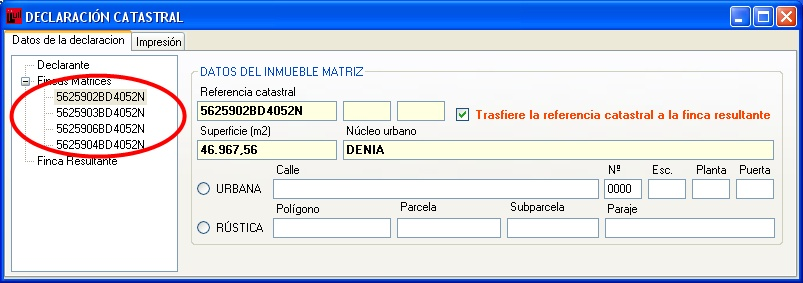
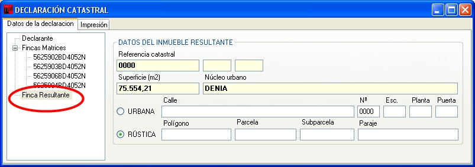
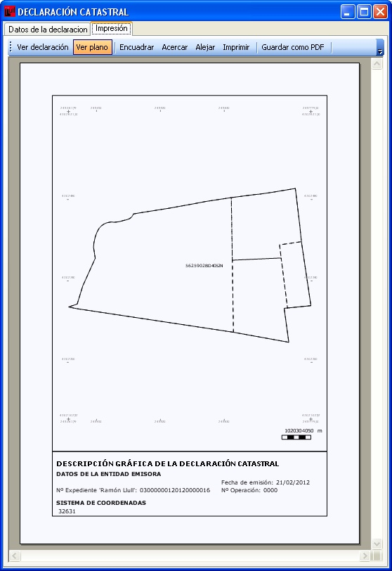
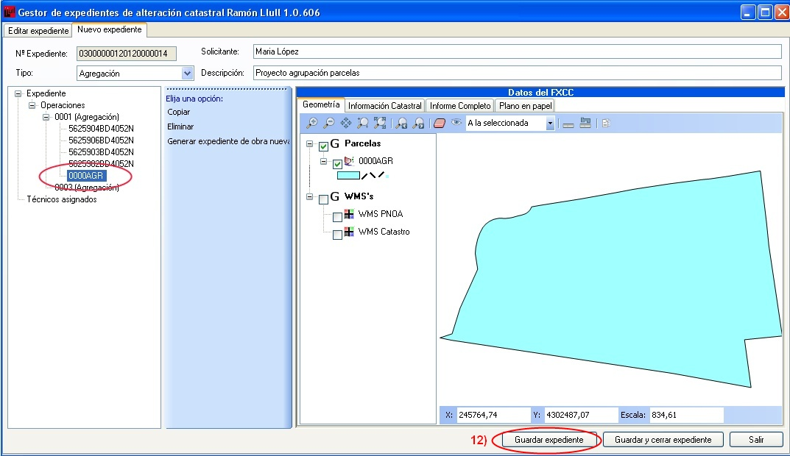
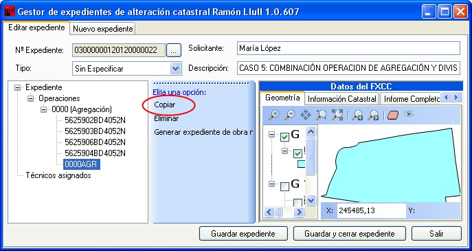
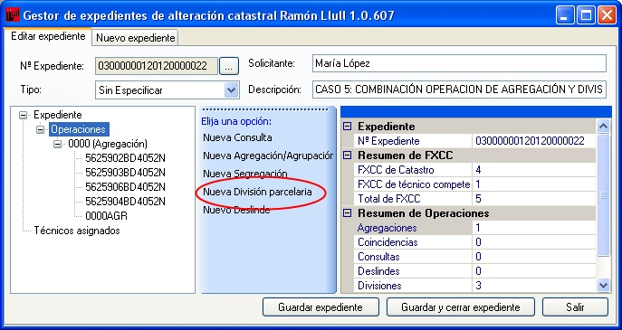
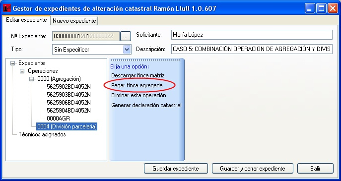
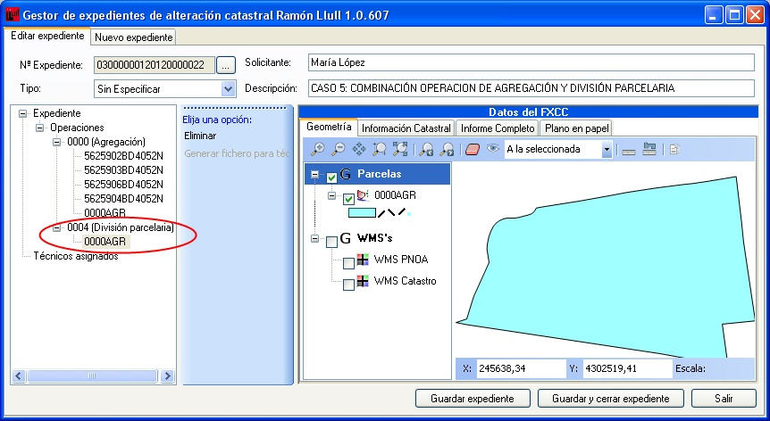
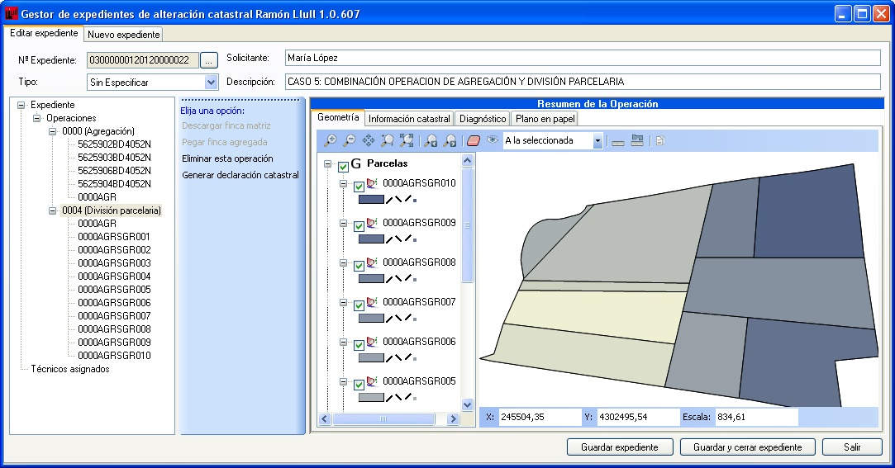
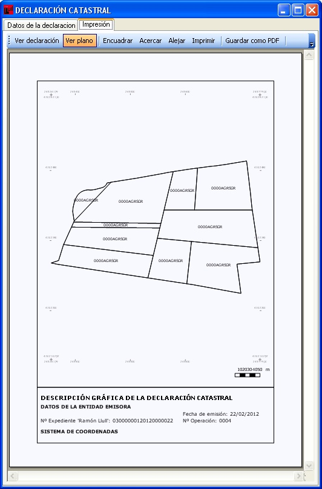

# Agregación + División

*Supuesto de hecho:*

María López compra cuatro parcelas colindantes para proyectar futuras viviendas. Por ello acude a la notaría con objeto de agrupar dichas parcelas en una finca. La parcela resultante de la agrupación se quiere dividir en ocho parcelas, seis para una promoción, otra para su cesión al Ayuntamiento, que condiciona concesión de la licencia a la cesión de la parcela citada.

*Referencias catastrales: *

**5625902BD4052N**

**5625903BD4052N**

**5625906BD4052N**

**5625904BD4052N**

1. Agrupación

*Resumen de la operación:*

La **Notaría** genera una nueva operación correspondiente a la agrupación y descarga, uno a uno, los inmuebles correspondientes a dichas referencias catastrales, archivando el expediente una vez terminada la descarga y asigna el expediente al técnico que va a realizar la división posterior.

*Procedimiento a seguir: *

1. Nos aseguramos que estamos en la pestaña de **nuevo expediente**.
2. El programa asigna un numero de expediente automáticamente.
3. Le indicamos el tipo de operación que se va a realizar.
4. Le indicamos el solicitante.
5. Insertamos una breve descripción del proyecto.
6. Con el botón derecho sobre **Operaciones** le indicamos la operación que vamos a realizar, en este caso **agregación**.
7. Utilizando **descargar finca inicial**, se van descargando una a una, las fincas que se van a agregar, insertando su referencia catastral.
9. Ventana donde se cargan las referencias catastrales de las fincas implicadas en la operación de agregación.
9. Podemos visualizar las cuatro parcelas que hemos añadido en la ventana gráfica.
10. Al generar la declaración catastral aparecen las siguientes ventanas:

**Declarantes**, ventana para insertar los datos del declarante.

En **Fincas Matrices** vemos los datos de cada una de las parcelas implicadas en la operación de agregación, referencia catastral, superficie, núcleo. Aquí es donde tenemos que indicarle la referencia catastral que va a ser transferida a la finca resultante.

En **Finca Resultante** vemos los datos de la parcela resultante de la operación de agregación, referencia catastral, superficie o núcleo urbano.

Por último, se genera informe en formato de impresión (pdf) con todos los datos de las parcelas implicadas, el inmueble resultante y un plano (con información de escala, coordenadas geográficas, etc). Se incluye un  anexo con todas  las declaraciones. 

Una vez descargadas todos los inmuebles, la Notaría genera el fichero correspondiente al inmueble resultante de la agrupación, mediante **Generación de parcela resultante**.

A la hora de salir, nos aseguramos siempre de guardar los cambios realizados en el expediente.

**2. División parcelaria**

*Procedimiento a seguir*

Siguiendo en el mismo expediente, el técnico o el Notario, genera la operación de **División parcelaria**.
Se arrastra la parcela agrupada en la operación anterior  mediante **Copiar** y **Pegar finca agregada**.

El **técnico** genera el fichero DXF. Desde un programa CAD se modifica la parcela se divide en varias parcelas (adapta el trabajo de campo y/o de gabinete previo) siempre sobre el fichero DXF generado por el Ramón Llull.

**Guarda el fichero en versión DXF**.  Es muy importante guardar el fichero en la versión más antigua de DXF que permita el programa, ASCII (ASCIIR12).

Carga el fichero en la aplicación y archiva el expediente con las modificaciones efectuadas.

Al acceder al expediente de nuevo, desde la Notaría, ya le aparecerán las operaciones de agrupación y división parcelaria realizadas  por el técnico competente y proceder a **Generar la declaración catastral**.

