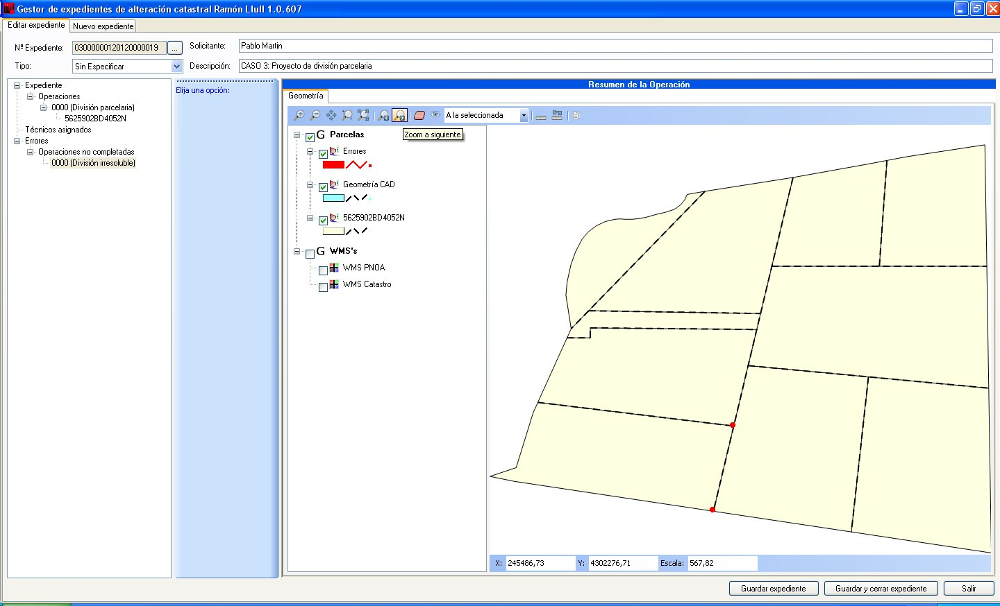
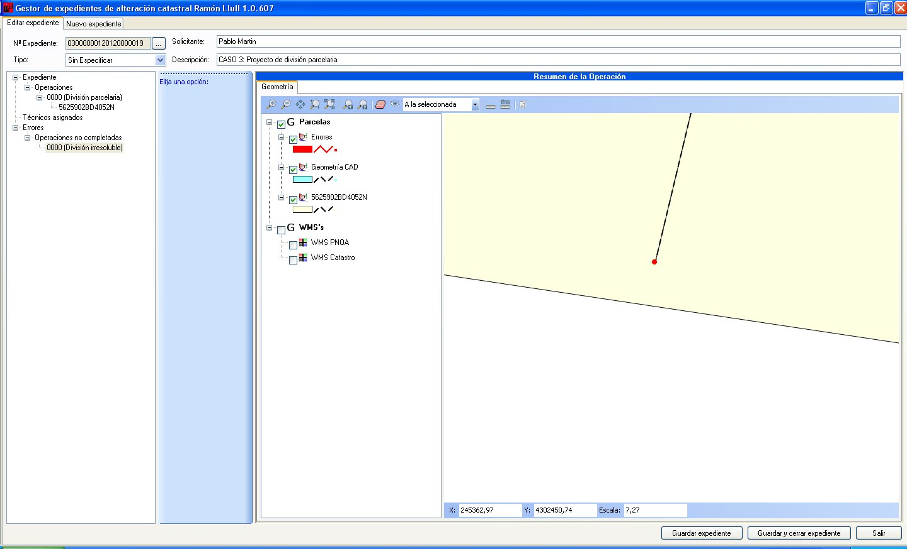

# Control de errores

Existe en la aplicación una funcionalidad para detectar errores en el dibujado de la alteración sobre el fichero DXF. 

De manera, que si el técnico no cerrase correctamente un polígono la aplicación lo detecta y lo muestra. En las siguientes imágenes se parte de un supuesto en el que el técnico al trazar una de las líneas no ha llegado a cerrar el polígono, el programa detecta tal anomalía y lo muestra en pantalla.

En la primera pantalla se ven los errores pero no se aprecia, si nos acercamos mediante la herramienta de zoom al error (marcado con punto rojo), vemos como la línea no llega a cerrarse.