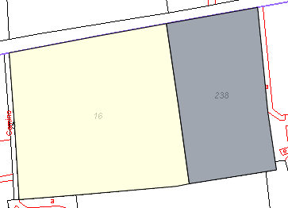

# Deslinde

*Supuesto de hecho: *

Juan García y Antonio Soler, quieren modificar el linde común de sus parcelas (lindero Este del primero, y lindero Oeste del segundo), puesto que el que aparece en Catastro no coincide con la realidad. Las referencias catastrales de las parcelas afectadas por el deslinde son:

*Referencia Catastral:*

**03063A03100016** (Inmueble de Juan García)

**03063A03100238**  (Inmueble de Antonio Soler)

*Resumen de la operación:*

Al igual que las operaciones anteriores, la Notaría inicia un expediente, genera la operación correspondiente al deslinde, descarga las fincas correspondientes a esas referencias catastrales, lo asigna al técnico y archiva el expediente.
