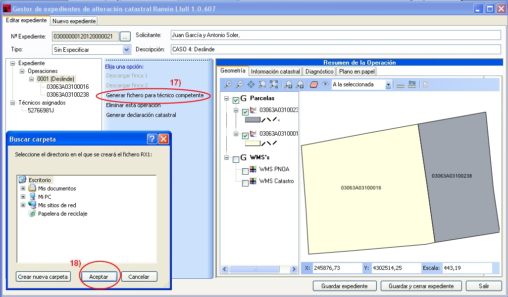
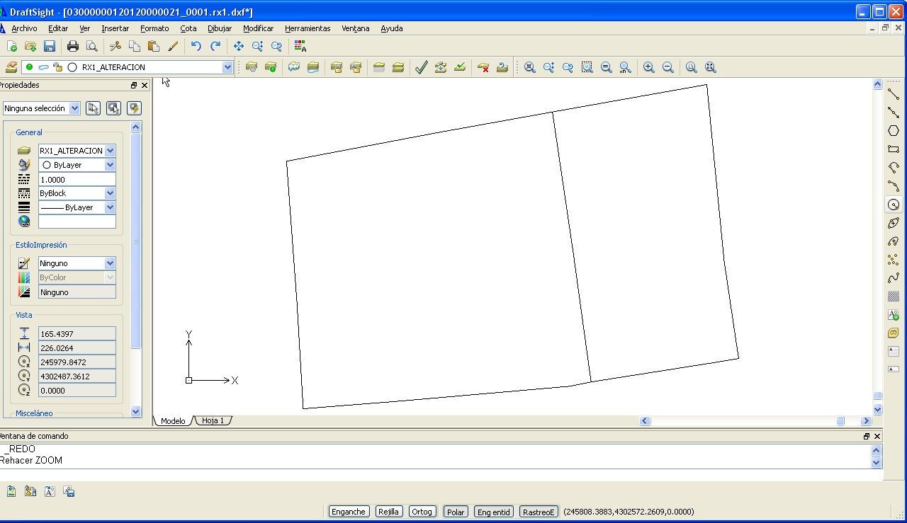
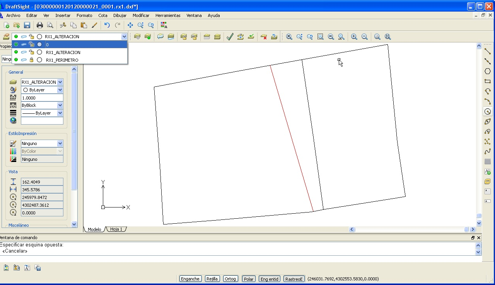
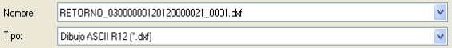
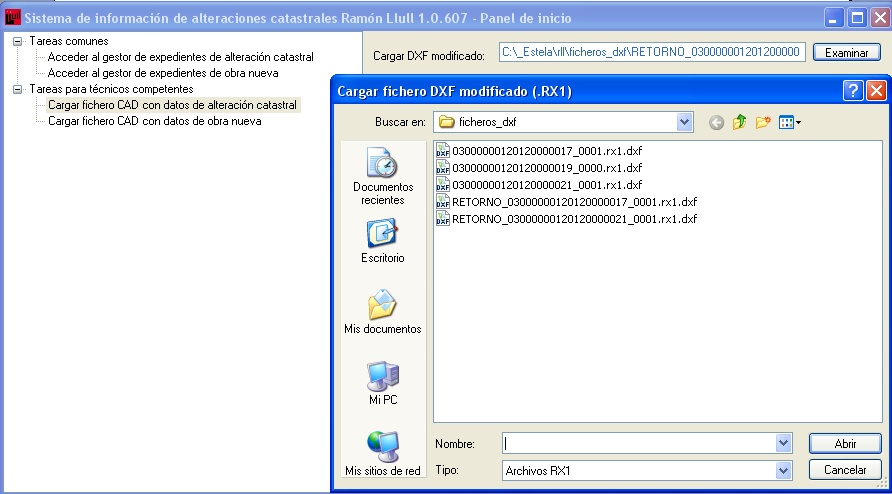
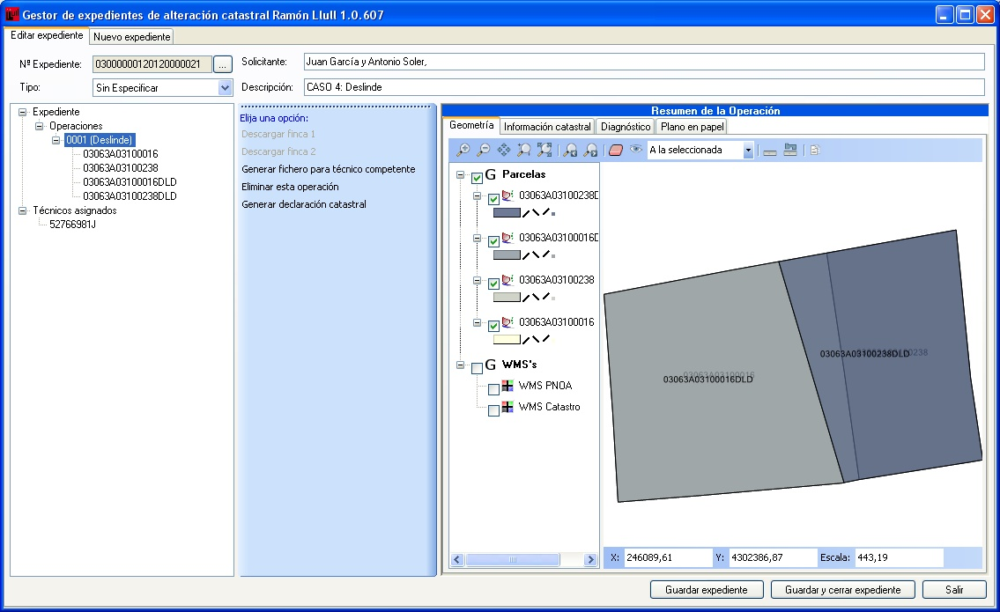
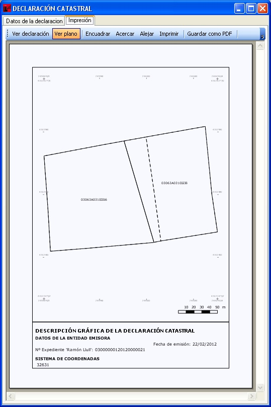

# Deslinde

*Supuesto de hecho: *

Juan García y Antonio Soler, quieren modificar el linde común de sus parcelas (lindero Este del primero, y lindero Oeste del segundo), puesto que el que aparece en Catastro no coincide con la realidad. Las referencias catastrales de las parcelas afectadas por el deslinde son:

*Referencia Catastral:*

**03063A03100016** (Inmueble de Juan García)

**03063A03100238**  (Inmueble de Antonio Soler)

*Resumen de la operación:*

Al igual que las operaciones anteriores, la Notaría inicia un expediente, genera la operación correspondiente al deslinde, descarga las fincas correspondientes a esas referencias catastrales, lo asigna al técnico y archiva el expediente.

*Procedimiento a seguir:*

1. Generamos un nuevo expediente en la pestaña de **nuevo expediente**.
2. El programa asigna un numero de expediente automáticamente.
3. Le indicamos el tipo de operación que se va a realizar.
4. Le indicamos el solicitante o los solicitantes.
5. Insertamos una breve descripción del proyecto.
6. Con el botón derecho sobre **Operaciones**, se despliega un menú con las operaciones que puedes realizar.
7. Le indicamos la operación que vamos a realizar, en este caso **Nuevo Deslinde**.
8. Guardar el expediente.
9. En el árbol de operaciones, al ponernos sobre la operación deslinde. 
10. Al ponernos sobre la operación **Deslinde** nos aparecen las opciones de **Descargar finca 1** y **Descargar finca 2**.
11. Nos sale la ventana donde insertamos las referencias catastrales de las dos fincas afectadas por el deslinde.
12. Hay que **Guardar los expediente**, para generar el fichero para técnico competente.
13. En el árbol del expediente pinchamos sobre **Técnicos asignados**.
14. Al **Asignar nuevo técnico** nos sale el formulario donde insertar los datos del técnico. Si ya se ha trabajado con él, insertando el DNI se recuperan sus datos  mediante **Copiar de una asignación previa**.
15. Le damos al botón **Asignar**.
16. Hay que **Guardar expediente**, sino no dejará generar fichero para técnico competente.  El técnico abre el expediente que le ha sido asignado y genera, desde la aplicación, el fichero para técnico competente (fichero DXF), sobre el que adaptará el proyecto técnico de deslinde al perímetro proporcionado por este fichero (en coordenadas geográficas UTM de Catastro). 
17. Le damos a “Generar fichero para técnico competente”.
18. Le especificamos una ruta de salida y lo guardamos. 
 
Desde un programa CAD se modifica el límite entre las fincas. Se dibuja el nuevo límite entre las dos parcelas (adaptando el trabajo de campo y/o de gabinete previo) siempre sobre el fichero DXF generado por la aplicación Ramón Llull (PRL). 

Una vez efectuada la operación, el fichero resultante se archiva con el prefijo *retorno_*, manteniendo el resto del nombre (\*.rx1.dxf).

Es muy importante guardar el fichero en la versión más antigua de DXF que permita el programa ASCII R12, (por defecto  Autocad  guarda en formato ASCII).

Volvemos a abrir la aplicación **PRL** y cargamos el fichero DXF, que acabamos de crear, en la aplicación y archiva el expediente con las modificaciones introducidas.

Al cargar el fichero vemos como los cambios que hemos introducidos en el límite entre parcelas y cargado en nuestra aplicación ya aparecen reflejados en el expediente. Ya nos aparecen en el árbol de operaciones, además de la parcela originaria, las  nuevas parcelas resultantes de la operación de segregación.

La **Notaría** al abrir el expediente ya le aparecerán las operaciones realizada de división en parcelas por el técnico competente y generar la declaración catastral. 
