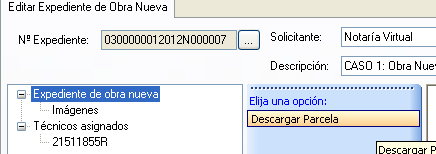

# Obra nueva

*Supuesto de hecho:*

José Pérez tiene una parcela donde ha proyectado un chalet, y  desea darlo de alta en Catastro. 

La referencia catastral de la parcela es **03006A00400036**.

*Procedimiento a seguir*

1. El notario o empleado de notaria accede a la aplicación y desde la ventana principal accede al **Gestor de Expedientes de Obra Nueva**.  
2. Crea un expediente nuevo (se asigna automáticamente un nuevo número de expediente de Ramón Llull). 
 
 

3. Rellena los campos **Solicitante** y **Descripción**, si no los completa, la aplicación dará un error.
 
 
 
4. **Asigna** un técnico al expediente creado.
5. Guarda el expediente.
6. El técnico accede ahora a la aplicación, y abre el expediente al que ha sido asignado. 
7. El técnico se descarga el perímetro de la parcela correspondiente a la referencia catastral dada, en cuyo interior se va  a proyectar la obra nueva.  
8. Una vez descargada la parcela, la aplicación genera automáticamente la Planta General y las Plantas  Significativas, que serán definidas por el técnico. 
9. **La planta general** es la representación, dentro de la línea perimetral de la parcela, de los recintos de las distintas subparcelas o áreas de diferente grado o tipo de edificación que la componen.  Coincide con representación de la parcela en la cartografía catastral. Es lo que el RD/1997 define como superficie de ocupación en planta.  
	A continuación sobre la planta general el técnico va a definir cada una de las plantas que componen la identificación distinguiendo cada una de ellas sus diferentes usos. De acuerdo con la terminología catastral, todas las plantas iguales en superficie y uso dentro de una construcción reciben la denominación de planta significativa. Pero en todo caso, la aplicación distingue el nivel en que se halla cada planta. 
	Así por ejemplo, en la siguiente figura se puede apreciar el aspecto y distribución que tendría una planta significativa de una obra nueva.
     Cada **planta significativa** tendrá incluidas todas las construcciones de esa planta en todos los edificios. Por ejemplo, si una parcela tiene dos edificios, uno de dos plantas y otro de una, en la planta baja estarán los dos edificios y en la primera solo el que tiene dos plantas.  
    
10. El proyecto consta de una vivienda con dos plantas y una piscina. 
11. Cuando se añaden las plantas significativas, los nombres es importante que no contengan espacios en blanco. Una vez creado el esqueleto sobre el que crear el proyecto o adecuar el existente a éste, se crea el fichero dxf pulsando Generar fichero para técnico competente. 
12. Guardamos el expediente y salimos.
13. El técnico, desde un programa CAD, debe editarlo y debe ir insertando las plantas según correspondan (planta general o planta significativas). De manera que en la capa RX1_LINEASINTERIORES, corresponde a la división de usos de toda la parcela; PLANTA_BAJA y PRIMER_PISO corresponden a las plantas significativas. 
14. Cada uno de los usos en los que se descompone las plantas deben ir etiquetadas según la nomenclatura de Catastro. Ej: vivienda = v; terraza=tza...
15. Guarda el fichero en la versión más antigua de dxf que permita el programa. 
16. Carga el fichero en la aplicación y archiva el expediente con las modificaciones introducidas. 
17. La aplicación debe mostrar ahora cada una de las plantas con sus divisiones correspondientes. Una vez cargada de nuevo el fichero CAD en la aplicación, el notario puede abrirlo de la misma forma que se ha expuesto previamente para las operaciones de alteraciones catastrales, y obtener de la misma, las superficies exigidas por la legislación registral para su inscripción en el Registro de la Propiedad, es decir, la superficie de ocupación en planta, la superficie total construida, el número de plantas y la distribución (usos) de cada planta.  De esta forma, el Notario, a parte de tener la información gráfica apta para ser cargada en el Catastro, dispone de los datos alfanuméricos de la misma para la correspondiente escritura, sin que pueda existir contradicción en los mismos. 
18. Guardamos el expediente.
19. El Notario accede al expediente, y genera la declaración catastral.