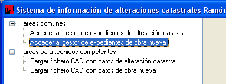

# Obra nueva

*Supuesto de hecho:*

José Pérez tiene una parcela donde ha proyectado un chalet, y  desea darlo de alta en Catastro. 

La referencia catastral de la parcela es **03006A00400036**.

*Procedimiento a seguir*

1. El notario o empleado de notaria accede a la aplicación y desde la ventana principal accede al **Gestor de Expedientes de Obra Nueva**.  
2. Crea un expediente nuevo (se asigna automáticamente un nuevo número de expediente de Ramón Llull). 
 
 

3. Rellena los campos **Solicitante** y **Descripción**, si no los completa, la aplicación dará un error.
 
 
 
4. **Asigna** un técnico al expediente creado.
5. Guarda el expediente.
6. El técnico accede ahora a la aplicación, y abre el expediente al que ha sido asignado. 
7. El técnico se descarga el perímetro de la parcela correspondiente a la referencia catastral dada, en cuyo interior se va  a proyectar la obra nueva.  
8. Una vez descargada la parcela, la aplicación genera automáticamente la Planta General y las Plantas  Significativas, que serán definidas por el técnico. 
9. **La planta general** es la representación, dentro de la línea perimetral de la parcela, de los recintos de las distintas subparcelas o áreas de diferente grado o tipo de edificación que la componen.  Coincide con representación de la parcela en la cartografía catastral. Es lo que el RD/1997 define como superficie de ocupación en planta.  
	A continuación sobre la planta general el técnico va a definir cada una de las plantas que componen la identificación distinguiendo cada una de ellas sus diferentes usos. De acuerdo con la terminología catastral, todas las plantas iguales en superficie y uso dentro de una construcción reciben la denominación de planta significativa. Pero en todo caso, la aplicación distingue el nivel en que se halla cada planta. 
	Así por ejemplo, en la siguiente figura se puede apreciar el aspecto y distribución que tendría una planta significativa de una obra nueva.
    Cada **planta significativa** tendrá incluidas todas las construcciones de esa planta en todos los edificios. Por ejemplo, si una parcela tiene dos edificios, uno de dos plantas y otro de una, en la planta baja estarán los dos edificios y en la primera solo el que tiene dos plantas.  
    
10. El proyecto consta de una vivienda con dos plantas y una piscina.