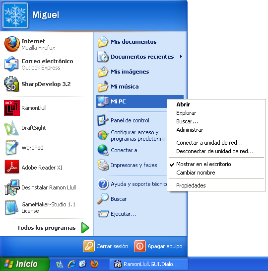
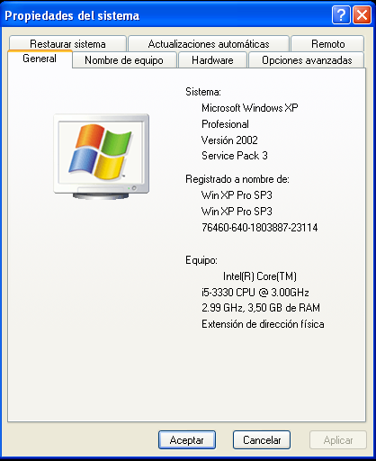

# Requisitos

La aplicación ha sido probada con éxito en Windows XP o superior, pero hay que tener una serie de consideraciones antes de comenzar a usar la aplicación. A partir de Windows Vista, la aplicación funciona sin tener que instalar nada complementario, no así en Windows XP que debe tener instalado el Service Pack 3 y el Service Pack 3.

**Service Pack 3**

Para que la aplicación funcione correctamente en Windos XP debemos comprobar que tenemos instalado en primer lugar el Service Pack 3, que es un paquete de  actualizaciones del sistema operativo. 

¿Cómo saber si lo tenemos instalado?

En el escritorio vamos a **Inicio** y pulsamos con el botón derecho del ratón sobre el icono **Mi PC**:

Y pulsamos sobre **Propiedades**, nos mostrará la siguiente información:

Si no aparece en la descripción el Service Pack 3 habrá que instalarlo. Para ello descargamos un archivo ejecutable desde la dirección [http://www.microsoft.com/downloads/info.aspx?na=41&SrcFamilyId=5B33B5A8-5E76-401F-BE08-1E1555D4F3D4&SrcDisplayLang=es&u=http%3a%2f%2fdownload.microsoft.com%2fdownload%2f9%2f4%2f2%2f942080a4-ba69-496b-a379-d3b26d37b647%2fWindowsXP-KB936929-SP3-x86-ESN.exe](http://www.microsoft.com/downloads/info.aspx?na=41&SrcFamilyId=5B33B5A8-5E76-401F-BE08-1E1555D4F3D4&SrcDisplayLang=es&u=http%3a%2f%2fdownload.microsoft.com%2fdownload%2f9%2f4%2f2%2f942080a4-ba69-496b-a379-d3b26d37b647%2fWindowsXP-KB936929-SP3-x86-ESN.exe)

Una vez descargado pulsamos sobre el archivo dos veces con el botón izquierdo del ratón y comenzará a instalarse. Una vez instalado es necesario reiniciar el sistema.

**Framework .35 .NET**

Para comprobar si está instalado el framework 3.5 seguimos la secuencia siguiente:
**Inicio** > **Panel de Control** > **Agregar o quitar programas** y se abrirá una ventana con los programas y las actualizaciones instalados, y debe aparecer *Microsoft .NET Framework 3.5*.

