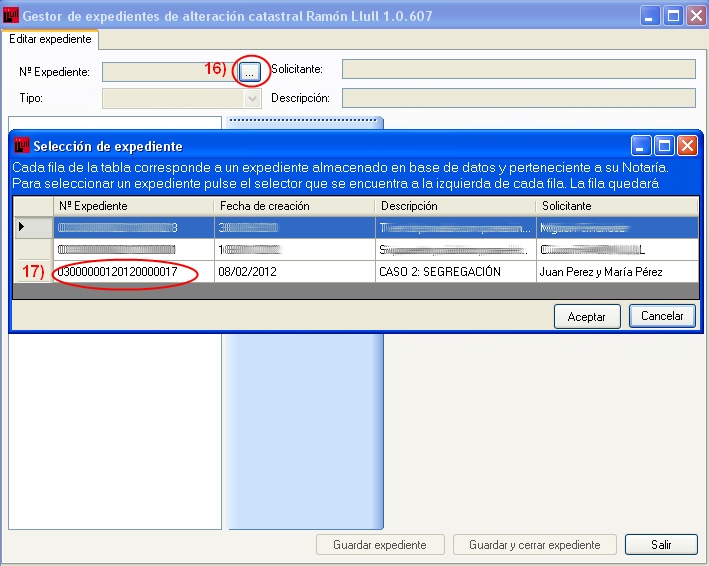

# Segregación + División

*Supuesto de hecho:*

los hermanos Martín,  Juan y Pablo, han heredado por mitades un terreno y quieren dividir la finca en dos parcelas de la misma extensión con el fin de adjudicarse cada uno de ellos una de las parcelas resultantes. Se ha obtenido la correspondiente licencia de segregación. Pablo se adjudica la finca segregada y Juan se queda con el resto de finca matriz. A su vez Pablo quiere dividir la parcela que se ha adjudicado en tres parcelas independientes para su posterior promoción. También ha obtenido la correspondiente licencia.

*Referencia catastral:*

**03900A04900121**

**1. Segregación**

Resumen de la operación:
Desde la Notaría se genera la operación correspondiente a la segregación, descarga la finca correspondiente a esa referencia catastral, lo asigna al técnico y archiva el expediente.

Procedimiento a seguir
1. Generamos un nuevo expediente en la pestaña de **nuevo expediente**.
2. El programa asigna un numero de expediente automáticamente.
3. Le indicamos el tipo de operación que se va a realizar, en este caso **Segregación**
4. Le indicamos el solicitante o los solicitantes.
5. Insertamos una breve descripción del proyecto.
6. Con el botón derecho sobre **Operaciones**, se despliega un menú con las operaciones que puedes realizar.
7. Le indicamos la operación que vamos a realizar, en este caso **Nueva Segregación**.
8. Se añade la referencia catastral de la finca objeto de la operación. 
9. Ventana donde se carga la referencia catastral de la finca objeto de la operación de segregación.
10. Hay que **Guardar los expediente**, para que se pueda generar fichero para técnico competente.
11. Vamos a **Asignar nuevo técnico** a este expediente.
12. Asignamos nuevo técnico.
13. La **Notaría** asigna a este expediente un técnico competente.
14. Ahora ya aparecen los técnicos asociados a ese expediente.
15. Hay que asegurarnos, siempre de guardar el expediente, antes de salir.El **técnico** abre el expediente que le ha sido asignado y genera, desde la aplicación, el **fichero para técnico competente** (fichero DXF), sobre el que adaptará el proyecto técnico de segregación al perímetro dado en este fichero (en coordenadas geográficas UTM de Catastro).
16. Abrir el gestor de expedientes y pinchando  en el botón de nº de expediente.
17. Se abrirá la ventana donde aparece una lista de todos los expedientes que tiene asignados ese técnico con independencia de la Notaría que lo haya asignado. Pinchamos sobre el expediente con el que estamos trabajando, en este caso el **03000000001201200000017**, que en la imagen aparece rodeado en rojo.
18. Al pincha sobre él aparecerá el expediente con todos los datos, que se han generado inicialmente en la notaria, en nuestra ventana de Gestión de expedientes. Generamos el fichero DXF (fichero de intercambio), que será utilizado como base por el técnico para la segregación de la parcela en un programa de edición gráfica.
19. Le indicamos donde se guardará el fichero y le damos a aceptar.

Desde un programa CAD, parte la finca con una polilínea que divida la finca en dos parcelas (la finca segregada y el resto de finca matriz), adaptando al fichero generado por el Ramón Llull el trabajo previo de campo o de gabinete.

Una vez efectuada la operación, el fichero resultante se archiva con el prefijo *retorno_*, manteniendo el resto del nombre (\*.rx1.dxf).
Es muy importante guardar el fichero en la versión más antigua de DXF que permita el programa, ASCII (ASCIIR12).

Volvemos a abrir la aplicación **Ramón Llull** y cargamos el fichero DXF, que acabamos de crear, en la aplicación y archiva el expediente con las modificaciones introducidas.

Al cargar el fichero vemos como los cambios que hemos realizado en la parcela y cargado en nuestra aplicación ya aparecen reflejados en el expediente. Archiva el expediente con las modificaciones introducidas.

Ya aparece en el árbol de operaciones nos aparece la parcela originaria:

Por otro lado aparecen, también en el árbol de operaciones, las dos **parcelas resultantes** de la operación de segregación.

**2. División parcelaria**

Al pincha sobre él aparecerá el expediente con todos los datos, que se han generado inicialmente en la notaria, en nuestra ventana de Gestión de expedientes.

Procedimiento a seguir
Siguiendo en el mismo expediente, el **técnico** o el **Notario**, genera la operación de **División parcelaria**.
Se arrastra la parcela agrupada en la operación anterior  mediante **Copiar** y **Pegar finca agregada**.

Se copia la parcela resultante de la operación de segregación anterior.